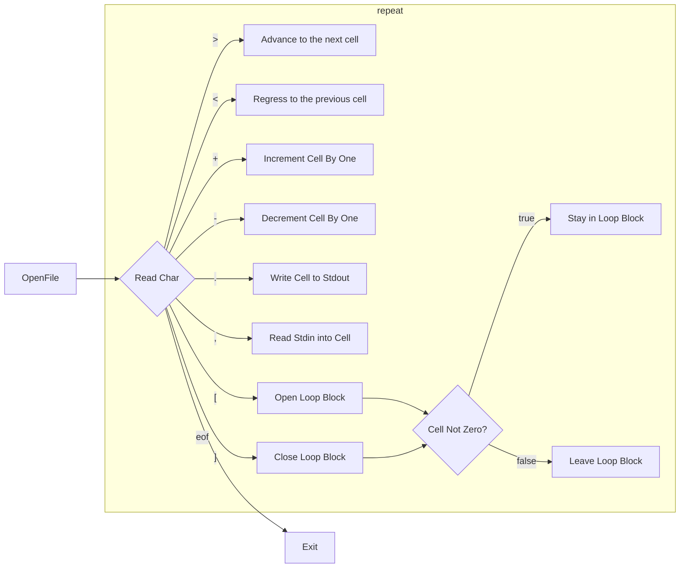

# Ache

Run-of-the-mill brain fuck interpreter.

## Brain Fuck

Brainfuck is a minimalistic esoteric programming language created by Urban Müller in 1993.

[Wikipedia](https://en.wikipedia.org/wiki/Brainfuck)

Consist of eight operators



## Build

```bash
g++ -std=c++14 -o ache src/ache.cpp
```

## Run

```bash
./ache brainfuck_samples/hello.bf
```

## License

[MIT](LICENSE.md)